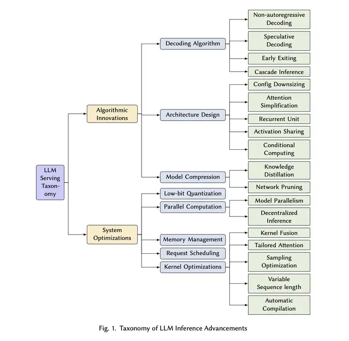

### performance optimization

what are the common performance bottlenecks and optimizations you can do for models?

1. model loading - checkpointing taking too long to load
2. communications - compute is actually way faster
3. data movement/bandwidth - quantization helps here wont help in compute bound cases(prefill)
4. speculative decoding
4. prefix caching
5. continous batching
6. a good scheduling algorithm
7. fusion - torch compile
8. cuda graphs 
9. kv caching and offloading
10. pruning
11. pd disaggregation

resources
1. kv aware routing - https://www.baseten.co/blog/how-baseten-achieved-2x-faster-inference-with-nvidia-dynamo/#how-baseten-uses-nvidia-dynamo
2. good read on loseless and numerics mismtach- https://github.com/vllm-project/vllm/issues/7627

