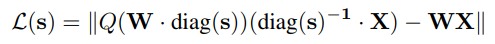
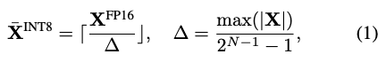
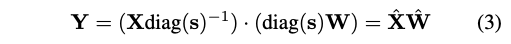
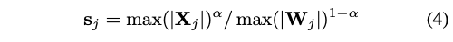

## Notes on quantization

read the primer on my blogs/ section - https://jino-rohit.github.io/blogs/blog.html


a nice mental model for quantization

quantization solves essentially a data movement problem. the problem is doing arithmetic is insanely quicker compared to moving data from one place to another.

why do we have to move things then?

its because the SRAM/registers are quite small compared to the HBM, where we hold all the weights of the llm. during each token generation, we carry a pice of data from HBM to SRAM, compute and then move back again. this movement is actually what makes the overall system slower not the computation itself.


when you quantize from a larger fp16 to say fp8, this doesnt mean computation is faster, it means we have lesser data to transfer and hence the overall system is way faster now.


let me illustrate with an example. 

say you have a A100 with -
- memory bandwith of 2000 GB/s
- computing power of 312 TFLOPS

you want to generate from a model with 100 B parameters.

data transfer

for fp16, we need 16 bits or 2 bytes for each param. so total data volume = 100 x 10^9 x 2 = 200 GB
for fp8, we need 1 byte, so total data volume = 100 GB


actual computation( im going to simplify this to just be matrix multiplication that does multiplications and additions)

total computation load = 100 x 10^9 x 2 = 200 GFLOPS


now, how long does it take to generate one token in an A100?

the fp16 case

load data = 200 GB / 2000 GB/s = 0.1 s
to compute = 200 GLOPS / 312 TFLOPS = 0.0006 s

look at that, data transfer is over 100x slower than the actual computation itself.


now the fp8 case

load data = 100 GB / 2000 GB/s = 0.05 s
computations ~= 0.0006 s ( maybe a bit faster than fp16)

but look at this now, yes computation might be a bit faster but indeed loading data has now become signicantly faster!

this is in principle what all quantization algorithms try to do.


1. symmetric quantization (ref: https://newsletter.maartengrootendorst.com/p/a-visual-guide-to-quantization)

in symmetric quantization, the range of the original floating-point values is mapped to a symmetric range around zero in the quantized space. this means zero will
always be zero. its also called absmax quantization.


lets say we want to convert fp16 to int8 for the numbers

```
5.47 8.21 3.145 10.94
```

the max value in this range is 10.94
the max value of the int8 range is 127

scale factor = 10.94/127 = 0.086

now we quant the first value 5.47 to become = round(value / scale)
                                            = round(5.47 / 0.086)
                                            = round(63.60)
                                            = 64

to perform dequant, it becomes = scale * value
                               = 0.086 * 64
                               = 5.50

the error factor here is (5.50 - 5.47) = 0.03


2. Asymmetric quantization

In asymmetric quantization, the minimum and maximum values from the floating-point range map directly to the minimum and maximum values of the quantized range (not centered at zero).

floating-point range = [r_min, r_max]  
integer range = [q_min, q_max]

for INT8: [−128, 127]

scale factor

```
S = q_{max} - q_{min} / {r_{max} - r_{min}}
```

zero point
```
Z = q_min - r_min x S
```

quantization formula = q = round(r/S)

dequantization formula = r = S * (q)
	​


1. `bitsandbytes` or the `int8` paper 

- https://arxiv.org/pdf/2208.07339
- https://huggingface.co/blog/hf-bitsandbytes-integration


in this technique, we do matrix multiplication in int8 wotj almost no performance degradation.

the main algorithm -
1. from the hidden states(inputs), get the outliers(meaning something above a threshold) by column.
2. matmul the outliers in fp16 and the others in int8. we can afford to do this since the outliers are usually ~1%.
3. dequantize the non-outlier results and add them with the fp16 outlier results to produce the final fp16 output.

instead of using a single scale for the entire tensor (which performs badly because one large value can distort the whole representation), bnb uses vector-wise quantization. that means each row / column gets its own scale, allowing much better preservation of information while still getting the efficiency benefits of int8.


2. `awq` quantization

paper - https://arxiv.org/pdf/2306.00978

AWQ is a method for low-bit quantization of model weights. using this method, model weights can be quantized to 4 bits and then dequantized to FP16 (W4A16) during activation calculation. also, weights can be quantized to 3 bits or 8 bits based on AWQ, and then calculated using 4 bits, 8 bits, or 16 bits, leading to methods such as W4A4 and W4A8.

but the authors say W4A16 gives minimal loss of accuracy, so its most preferred.


there are three major points to understanding awq quantization - 

1. not all weights are equally important, only a small portion matter a lot

the authors show that only a very small subset of weights (around 0.1%–1%) have a huge impact on model accuracy. most weights can actually tolerate aggressive low-bit quantization without hurting the model too much.

this leads to an important idea -

if we can somehow protect only the important weights while quantizing the rest to int4/int3, we can drastically reduce memory usage and improve inference speed while keeping accuracy almost unchanged.


how do we identify these important (salient) weights?


1. random selection

randomly choose 0.1%–1% of weights and keep them in fp16.
this performs badly and is almost identical to naive round-to-nearest (rtn) quantization.


2. selection based on weight magnitude

here, weights are first sorted and the ones with the largest absolute values are treated as important.
surprisingly, the paper finds this performs almost as badly as random selection.
this is a pretty important observation because many older quantization methods assume:
larger weights = more important weights
but awq shows this is often not true for llms.

3. selection based on activation distribution


instead of looking at weight values themselves, the paper looks at activation magnitudes.

here, "activation" means the input tensor multiplied with the weight matrix during matmul.

for a linear layer - y = Wx

the activation is x and not the output.


the paper finds that selecting important weights based on activation statistics works dramatically better than selecting based on weight magnitude.
in fact, preserving only 0.1%–1% of activation-important weights in fp16 gives accuracy very close to full fp16 inference.


they also use channel-level instead of element-level where -

each input channel (column of the weight matrix) is treated as a unit
activation magnitudes are averaged per channel
channels with the largest activation magnitudes are considered salient

the problem with this approach
if some elements in the weight matrix are stored in FP16 format and others in INT4 format, both storage and retrieval becomes complicated and slow.
therefore, they propose scaling.

2. amplifying significant weights during quantization can reduce quantization error.

check the paper bit for this mathy equations

3. an algorithm to calculate the scaling factors


the goal is to minimize the difference between:
the original fp16 layer output
the quantized layer output after scaling



directly optimizing this equation is hard for two reasons.

1. quantization is non-differentiable

quantization contains a rounding operation round(soemthing) which is non-differentiable.
small changes in weights can suddenly jump to different integer buckets, making gradient-based optimization unstable.

2. the optimization problem is non-convex


awq simplifies this by observing channels with larger activations are usually more important.

so important channels should receive larger scaling factors and unimportant channels should receive smaller scaling factors
so instead of optimizing every scaling factor independently, awq derives scaling directly from activation statistics.

activation-based scaling

for each input channel:

- compute the average activation magnitude
- use this as the base importance score

the scaling factor becomes:

s = sX ^ alpha
sX is the average activation magnitude per channel
alpha ∈ [0,1] controls scaling strength

now we only need to search for alpha. this is done by taking 20 numbers on average in the interval [0,1], such as 0, 0.05, 0.10, 0.15, etc., and then calculates the different values ​​for each number. the optimal MSE loss is the one that minimizes the loss under alpha.


`group_size` is the only hyper param.

- a larger group size results in more weights per group and fewer quantization parameters, which may reduce the accuracy of the quantized model, but also lowers computational and storage costs.
- a small group size has fewer weights per group and more quantization parameters, which may result in higher model accuracy, but also increases computational and storage costs.
- the standard default value is 128.


quoting from this - https://github.com/vllm-project/llm-compressor/issues/1522

we found that using randomly generated tokens is good enough for smaller models (e.g. 8B scale), whereas for larger ones (e.g. 70B and 405B), we need to use a proper dataset to get an accurate quantized model. This aligns well with the intuition from above: during quantization, we want to trigger outliers/activations to properly capture their behavior.


3. `smoothquant` quantization

the general formula for quantization is - 



the problem w this formula is that unlike CNNs, LLMs have too many outliers in activations and hence if you use this, most of the outliers end up turned off to zero.

usually the model weights are more evenly distributed and hence quantization is easier. but only quantizing the weights only should give almost no perf
improvements. as a matter of fact, it might be even worse since during the calculation, you have to dequant the weight back to fp16 and then multiple with activations.

on the other hand, the outliers in activations are very difficult to handle.

authors found out outliers typically appear in a few specific channels of the activation values.
also if for a token, one of the specifc channel have a large activation value, the other channels also have large activations.

they thought maybe we should quantize outlier tokens differently.

1. detect outlier tokens at runtime,
2. use larger quantization scales for special channels,
3. use normal scales elsewhere.

but this indeed is hardware-unfriendly.


but if every token -

has different scales,
different quantization rules,
different channel handling,

then the GPU ends up branching, lots of memory accesses and slow down


what if we transfer the outlier from the activations to the weights?

they scale up the model weights and scale down the activations but mathematically the scale factor cancels each other out and remains unchanged.



this way, the "outlier" channels of the activation values ​​are smoothed, and this outlier portion is "transferred" to the weights. after this operation:
1. the overall variance of the activation values ​​decreased, reducing the difficulty of quantization.
2. the overall variance of the weights has increased, but their original variance was very small. even with the increase, the difficulty of quantification remains within an acceptable range.

cool, now the hyperparam to find is the `scale` factor.

1. scenario 1 is s = max(X)

this will cause all outliers of the activation values ​​to be transferred to the weights, making the activation values ​​easy to quantify, while the weights are difficult to quantify.

2. scenario 2 is s = 1 / max(X) 

which will make the variance of the weights, which originally had a smaller variance, even smaller, and the variance of the activation values ​​even larger.



by introducing a hyperparameter α, these two extreme cases can be balanced, they found α = 0.5 is the best case.


smoothing_factor - the degree to which outliers are balanced and shifted from activation values ​​to weights, or the degree of smoothing of the distribution of activation values.

1. using a larger factor can greatly smooth out outliers in activation values, reduce the overall variance of activation values, and make activation values ​​easier to quantify; the side effect is that the variance of the weights increases, making weight quantification more difficult.
2. using a smaller factor has little effect on smoothing outliers, and activation values ​​are difficult to quantify.
3. 0.5 is generally recommended.

smoothquant is usually W8A8.


4. `gptq` quantization

lots of primer needed to understand this (mostly calculus but on an application level not just theory understanding)

1. higher order derivatives
2. this is directly connected to using hessian matrix(then question why hessian matrix is going to be slow)
3. start understanding how taylor series can approximate the functions
4. read on lagrange multiplier   
4. read obs which is a network pruning method.
5. read obq which is a quantization that builds on top of this.(easy if you understand obs)

after this, reading the gptq paper should start making sense since gptq strips into obq and aims to make it faster.


a rough intuition for the `obs` algorithm

say you have a NN trained, you want to delete one weight(set it to zero), but dont want the models accuracy to drop.
how do we do this?

w = [w1, w2, w3] = [0.8, 0.05, 0.6]

step 1 - use taylor expansion to approximate the change in loss function

lets say we perturb the weights by a vector ΔW , change in loss is -

```
δL = (∂L/∂w)ᵀ Δw + ½ ΔwᵀH Δw + O(||Δw||³)
```

```
(remember taylor expansion is f(x) + f'(x)δ + ½f''(x)δ² + ...)
apply this to L(w + Δw)
```

first order derivative - (∂L/∂w)ᵀ Δw
this is the slope that tells how loss varies with a nudge in the weight

second order derivative - ½ ΔwᵀH Δw
this tells how the slope itself changes

cubic derivative - O(||Δw||³)


now drop the first term, why? if the model is trained, and the loss has converged, then there isnt any gradient.
drop the cubic term as well since the delta change is quite low, and the overall change is negligible.


so we are left with just -

```
δL ≈ ½ ΔwᵀH Δw
```

step 2 - understand the hessian H

H is a matrix of second derivatives, for our 3 weight example its 3x3
H[i,j] = ∂²L / (∂wi ∂wj)

the diagonal H[i,i] tells us - how sharply curved is the loss if we change weight i?
the off-diagonal H[i,j] tells us - if we change both wi and wj, how do they interact?

say our hessian looks like -
H = [ 4.0   0.5   0.2 ]
    [ 0.5   0.1   0.1 ]
    [ 0.2   0.1   3.0 ]

diagonal says - w1 has curvature 4.0 (steep), w2 has curvature 0.1 (flat), w3 has curvature 3.0 (steep)


step 3 - express "deleting weight q" as a constraint

wq is the weight need to modify

say we want to delete w2 (q=2). we need wq to become 0, so the change at position q is Δwq = -wq.

we use a one-hot vector eq to express this cleanly -

for q = 2: e2 = [0, 1, 0]

the constraint becomes -
Δw + w2 = 0

expanding: [0,1,0] [Δw1, Δw2, Δw3] + 0.05 = 0

so: Δw2 = -0.05 (the change at position 2 cancels out w2)

w1 and w3 are free, they'll be adjusted to compensate.


step 4 - solve the constrained optimization with lagrange multipliers

we want to -
- minimize: δL = ½ ΔwᵀH Δw (keep loss increase small)
- subject to: Δw + wq = 0 (weight q goes to zero)

lagrange multipliers let us combine these into one problem -
minimize: F(Δw, λ) = ½ ΔwᵀH Δw + λ(eqᵀ Δw + wq)

differentiate w.r.t Δw and set to zero -
H Δw + λeq = 0
Δw = -λ H⁻¹ eq

substitute back into the constraint to solve for λ -
eqᵀ(-λ H⁻¹ eq) + wq = 0
λ = wq / [H⁻¹]qq

[H⁻¹]qq is just the (q,q) entry of the inverse hessian, a single number.

plugging λ back in -
Δw = -(wq / [H⁻¹]qq) · H⁻¹ eq    weight update formula

this tells us exactly how to nudge every remaining weight to compensate for removing wq.


step 5 - the saliency score (which weight do we actually prune?)

substitute Δw back into δL = ½ ΔwᵀH Δw -
δL = ½ · wq² / [H⁻¹]qq    ---> saliency score

compute this for every weight, prune the one with the lowest score (least damage).

for our example, assume H⁻¹ diagonal ≈ [0.27, 11.1, 0.34] -
w1: ½ · 0.64 / 0.27  = 1.19
w2: ½ · 0.0025 / 11.1 = 0.00011  ---> smallest, prune this
w3: ½ · 0.36 / 0.34  = 0.53

w2 wins because it has a tiny value AND sits in a flat region (large [H⁻¹]qq).


note on [H⁻¹]qq vs H[q,q] -

large H[q,q] = steep curvature that means small [H⁻¹]qq so large saliency score and dangerous to prune
small H[q,q] = flat curvature means large [H⁻¹]qq so small saliency score and safe to prune

so [H⁻¹]qq acts as a flatness measure. the saliency formula balances two things -
- is the weight small? (wq²)
- is the region flat? ([H⁻¹]qq)

both need to be true for a weight to be a good pruning candidate.


`obq` algorithm

obq quickly extended this approach to quantization. 
pruning can be seen as a special type of quantization where we apprioximnate a value to 0, can be called 0 bit quantization.

so you extend this equation.

```
δL = ½ · wq² / [H⁻¹]qq
```

to 

```
δL = ½ · (wq - quant(wq))² / [H⁻¹]qq
```


5. `QuIP: 2-Bit Quantization for LLMs`

good lecture -https://www.youtube.com/watch?v=6wEVz0wkhCM

