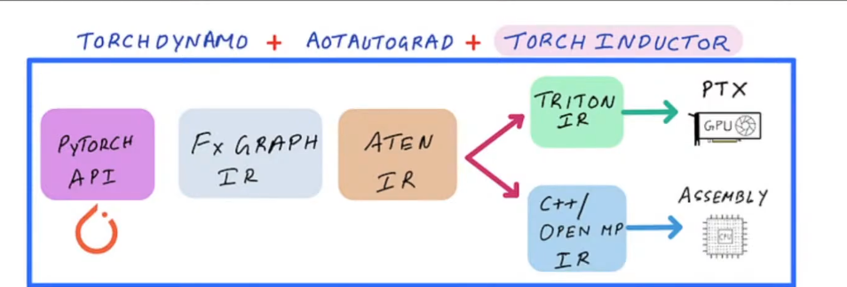

### how to use torch compile

ref - https://docs.pytorch.org/tutorials/intermediate/torch_compile_tutorial.html

torch compile is a method to speed up pytorch code after 2.0 using JIT compilation and requires almost litle to no change.
any python fn or pytorch module can be passed and will be replaced by the optimized one.

torch.compile takes extra time to compile the model on the first few executions. torch.compile re-uses compiled code whever possible, so if we run our optimized model several more times, we should see a significant improvement compared to eager. check ex 03_speedup.py
(improve thsi definition later on)


#### the compilation stack



this is the overall flow for the torch compile stack from my understanding - 

1. pytorch api - this is your regular nn.module that you write in torch.
2. dynamo - dynamo intercepts the regular python flow and captures these pytorch specific operations into a graph. you can think of them like DAGS.
3. fx graph - fx graph is pytorch's internal graph representation. this IR is pretty easy to work with and debug since its just graphs and it has only 6 main instructions.
4. aten ops - all the operation captured in the graph have to be lowered to the primitives written in C++ in torch, for instance cos, sin etc. all of them are present in the aten/ library.
5. torch inductor - this is the actual compiler backend that takes these aten ops, and finally lowers them into triton kernels and ptx and so on.


#### graph breaks

The graph break is one of the most fundamental concepts within torch.compile. It allows torch.compile to handle arbitrary Python code by interrupting compilation, running the unsupported code, then resuming compilation. The term “graph break” comes from the fact that torch.compile attempts to capture and optimize the PyTorch operation graph. When unsupported Python code is encountered, then this graph must be “broken”. Graph breaks result in lost optimization opportunities, which may still be undesirable, but this is better than silent incorrectness or a hard crash.


1. use fullgraph=True to identify and eliminate graph breaks. use also dynamo explain
2. you dont have to compile all the code, for example not worth compiling the data loading logic, disk IO etc.
3. common graph breaks cause -
    - incorrect code - turn off compile and check for correctness
    - data dependent code - if your control flow doesn’t actually depend on data values, consider modifying your code to perform control flow on constants.
    - use torch.cond control flows
    - print() logs will result in graph break. 
4. where to apply torch compile -
    - ideally at the highest level so it more oppurtinity to fuse things, remove redundant work, reduce kernel launches etc
5. use torch dynamo disable when you have a piece of code that is difficult or impossible to compile, but you still want the rest of your program to benefit from torch.compile. it does also cause graph breaks but the different is no dynamo recompilation wasted + no weird logs and errors. you already know ahead of time i dont want to waste time compiling this.
6. not all ops can be fused, pointwise ops yeah also for reduction kernels but is a bit harder compared to pointwise.
7. too much of fusion can be a bad thing if theres too much of a register presssure.
8. reduce overhead by using cuda graphs, that does the capture and replay, helps in case you have too many kernels. this is because every kernel from the host have to invoke device, setup data + cuda stream + transfer data etc


#### aten vs core aten vs prim ops

1. aten - aten seems to be the standard aten op set which is user facing like linear, conv, embedding etc.
you can do a quick search and verify from this list - https://github.com/pytorch/pytorch/blob/main/aten/src/ATen/native/native_functions.yaml


2. core aten - a small more concentrated subset of aten ops that native aten ops can be decomposed into. the problem is aten have over 2k+ ops which are usually just variations of a single op. so we need a standard set of minimal ops that every model can be decomposed into.
you can find the list here - https://docs.pytorch.org/docs/2.12/user_guide/torch_compiler/torch.compiler_ir.html
you can find a relevant discussion here - https://dev-discuss.pytorch.org/t/defining-the-core-aten-opset/1464

3. prim ops - this is the lowest level and has atomic ops like prim.add, prim.mul etc
you can find the list here - https://docs.pytorch.org/docs/2.12/user_guide/torch_compiler/torch.compiler_ir.html


the heirachy kinda looks like this -

```
aten(full set) --> decomposes to core aten(smaller subset) --> decomposes to prim ops(atomic ops)
```